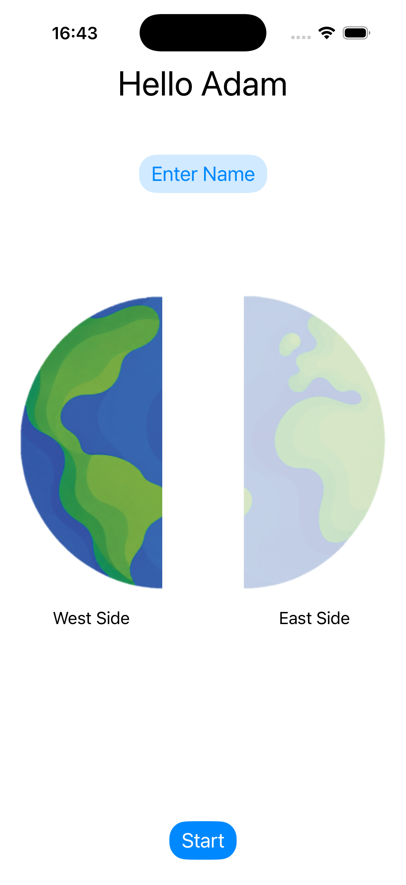
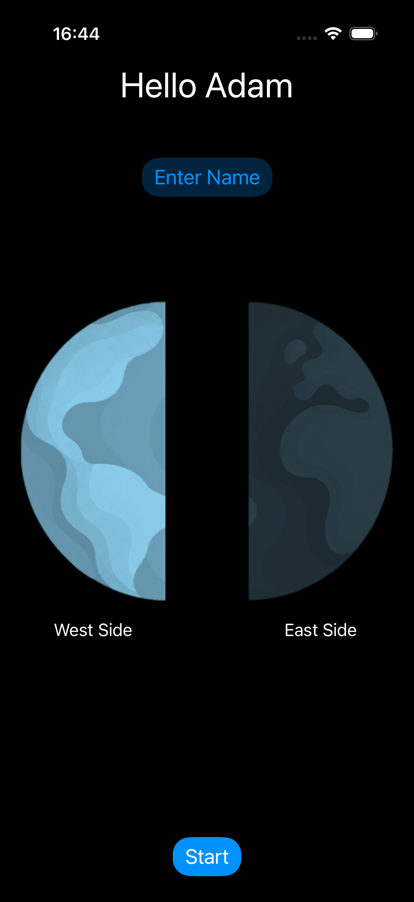
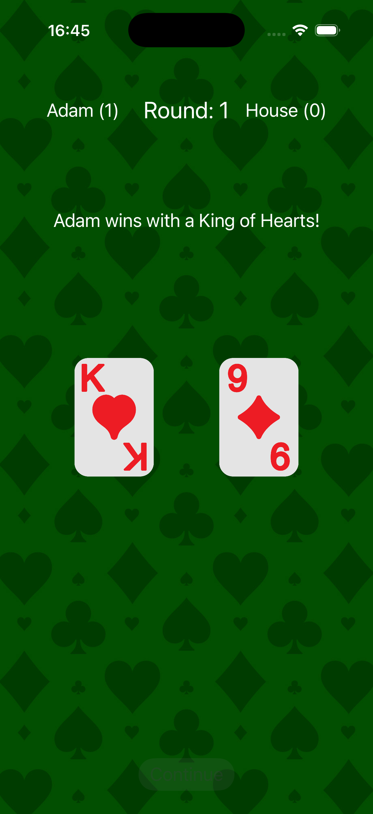
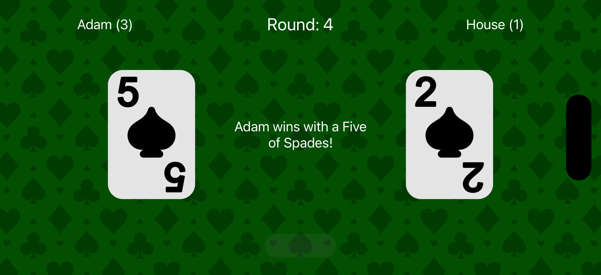
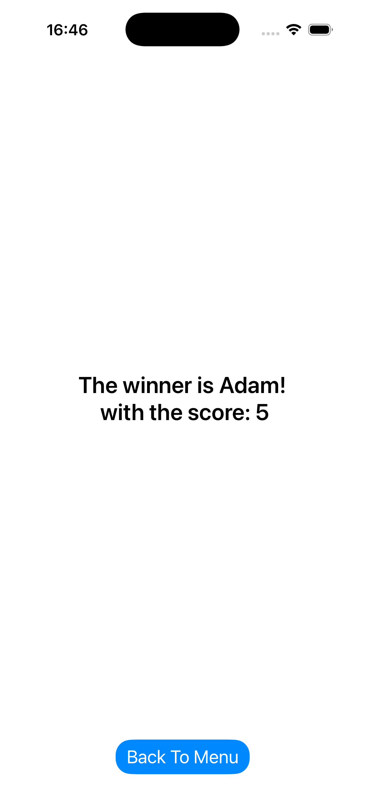
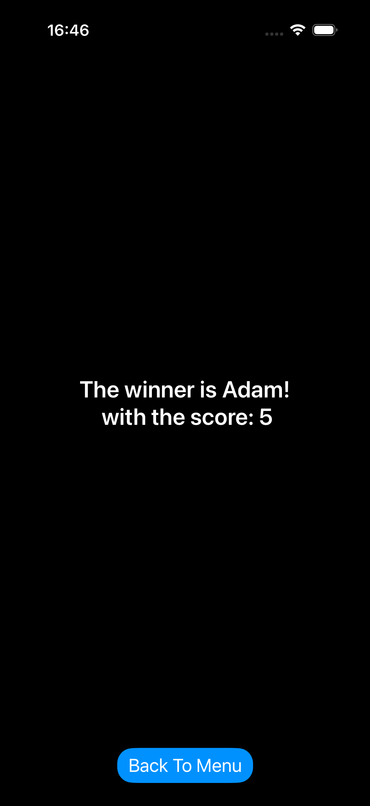

# iOS Card Game 🃏

An interactive, feature-rich iOS card game built with Swift and UIKit. The primary goal of this project is to demonstrate core iOS development concepts, including App Lifecycle management, CoreLocation, Auto Layout (Portrait & Landscape support), Light/Dark Mode adaptability, and custom Audio Management.

## ✨ Features
- **App Lifecycle & State Management:** Game timers and background music automatically pause when the app is minimized to the background and seamlessly resume when brought back to the foreground.
- **Dynamic Layouts:** Fully responsive UI that adapts to both Portrait and Landscape orientations.
- **Light/Dark Mode Support:** UI elements dynamically update based on the system's appearance settings.
- **CoreLocation Integration:** Uses the device's physical location to determine the player's side of the table.
- **Custom Audio Engine:** A centralized Singleton manager handles looping background music and overlapping sound effects (win, lose, card flips).

## 🛠 Requirements & Setup
- **macOS** 12.0+ (or later)
- **Xcode** 14.0+ (or later)
- **iOS** 18.0+ 

### Installation
1. Clone this repository: `git clone https://github.com/adamsat2/automatic-card-game.git`
2. Open the project in Xcode: `open card-game.xcodeproj`
3. Select an iOS Simulator or connected iPhone.
4. Hit `Cmd + R` to build and run.

### Location Setup (Simulator)
This game requires location permissions to determine your starting side. If running on a Simulator, you may need to simulate a location:
1. Run the app in the Simulator.
2. In the Mac menu bar, go to **Features > Location > Custom Location...**
3. Enter a latitude and longitude to test the East/West side assignment.

---

## 📱 Screens & Architecture

### 1. Home Menu (`ViewController`)
The entry point of the application. 
- **Location Check:** Requests location authorization to determine which side of the Earth the user is on (East or West). This assigns the player to the corresponding left/right side of the game table.
- **Input Validation:** Features a `UIAlertController` for name entry. Validates input to prevent empty strings or the reserved name "The House".
- **Dynamic UI:** The "Start" button only reveals itself once a valid name and location are secured. The background and text adapt completely to Light and Dark modes.

### 2. Game Board (`GameViewController`)
The core gameplay loop.
- **Responsive Design:** - *Portrait Mode:* Displays game info (names, round, scores) at the top, round results in the middle, and player cards at the bottom.
  - *Landscape Mode:* Reorganizes the layout to maximize screen real estate, placing round results and cards side-by-side below the header.
- **Gameplay Logic:** Each round, both players draw a random card. The highest value wins. A tie results in no points. 
- **Precision Timers:** The game operates on a strictly managed loop (2 seconds face-down, 3 seconds face-up). It utilizes `Date()` timestamps to accurately pause and resume the round exactly where it left off if the user minimizes the app.
- **Animations & Sound:** UIView transitions handle the card flipping animations, paired with synchronized sound effects.
- **Theming:** Utilizes a static green casino table background, remaining consistent across Light and Dark modes to preserve the gaming aesthetic. After 10 rounds, the timer halts and a Continue button appears.

### 3. Score Summary (`ScoreViewController`)
The final results screen.
- **Dynamic Results:** Displays the winner's name and final score. If the player wins, a victory fanfare plays. If the game ends in a tie or the player loses, "The House" is declared the winner, accompanied by a losing sound effect.
- **Stack Management:** Features a "Back to Menu" button utilizing an Unwind Segue. This safely pops the view controllers off the stack to prevent memory leaks and retains the player's previously entered name on the home screen.
- **Theming:** Fully adapts to Light and Dark system settings.

